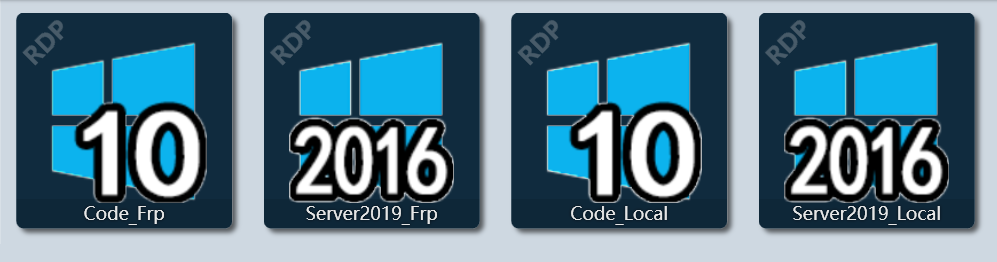
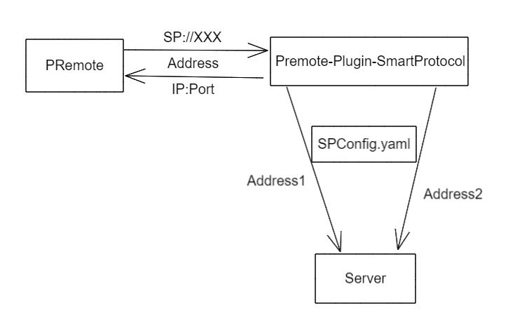

# PRemote Plugin SmartProtocol

> PS，If you want to try this plug-in，you need update your [PRemote](https://github.com/VShawn/PRemoteM) to **Inside Test Version**. Plug-in System is still discussed with author.
>
> It won't get your password!

[[中文]](readmeThings/README_CN.md)

This is a plug-in use by [PRemote](https://github.com/VShawn/PRemoteM) . It will be adjusted according to the use.

Support Protocol. see [go-protocol-detector](https://github.com/allanpk716/go-protocol-detector):

* RDP
* FTP
* SFTP
* SSH
* VNC
* Telnet

## Why

In some cases, [PRemote](https://github.com/VShawn/PRemoteM) need create a lot of server connection items. like:



This is just two servers,  but your may connect it in LAN, or mapping to local host by  [FRP](https://github.com/fatedier/frp) , like：


so [Premote-Plugin-SmartProtocol](https://github.com/allanpk716/Premote-Plugin-SmartProtocol) can give you another options.

## How To Use

if you have a server, it can be connected by 2 ways：

| IP:Port             | Connection Type   | Protocol |
| ------------------- | ----------------- | -------- |
| 127.0.0.1:53391     | FRP to local host | RDP      |
| 192.168.50.188:3389 | LAN               | RDP      |

1. Download [PRemote Test Version - branch - dev_SmartProtocol](https://github.com/allanpk716/PRemoteM/tree/dev_SmartProtocol)，at this time, you need build by yourself. (later....  after talk with the author , you can download zip. uzip to your localtion)；

2. download this plug-in, from  [Release](https://github.com/allanpk716/Premote-Plugin-SmartProtocol/releases) , Premote-Plugin-SmartProtocol.zip ( also you can build it all by yourself )；

3. uzip 2 files to PRemote folder ( Premote-Plugin-SmartProtocol.exe、SPConfig.yaml );

4. edit SPConfig.yaml file

   ```yaml
   SPConfigs:
     Code:
       ProtocolName: RDP
       TimeOut: 1000 # ms
       MultiAddress:
         - 127.0.0.1:53391
         - 192.168.50.188:3389
   ```

5. create a server connection item in [PRemote](https://github.com/VShawn/PRemoteM) , like：

   

   The important thing is **Address**，must be **SP://** , so fill your user name and password .

6. So you can call  **Code_SP**  by PRemote ；

## How To Work

PRemote will send the address( **SP://**  ) to PPSP(Premote-Plugin-SmartProtocol) , then PPSP will reply "IP:Port" which define in SPConfig.yaml.



## How To Build

```bash
go build
```

## TODO

Improve usability with [PRemote](https://github.com/VShawn/PRemoteM) .

