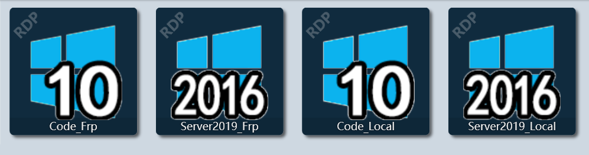
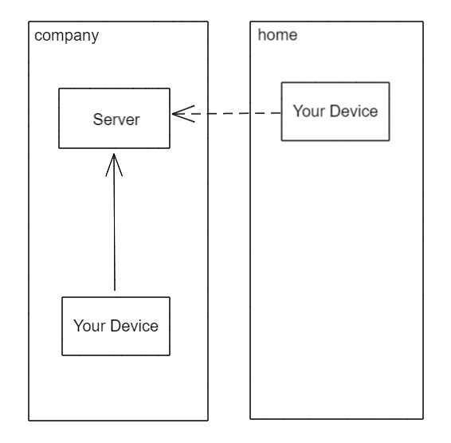
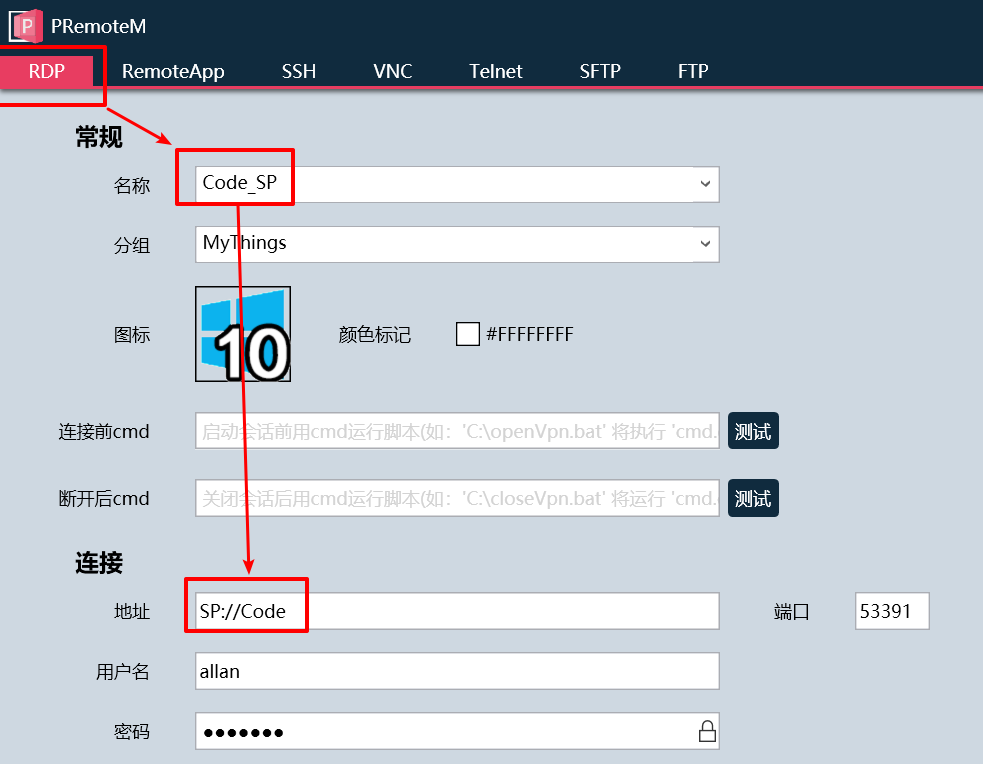
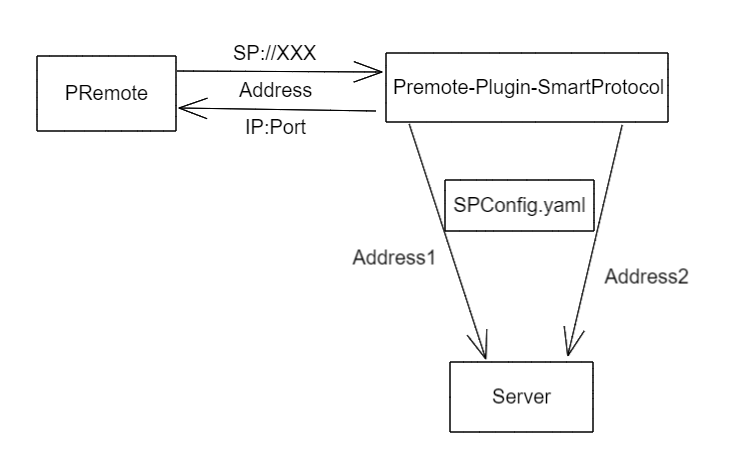

# PRemote Plugin SmartProtocol

> 注意，想要使用本插件，需要 [PRemote](https://github.com/VShawn/PRemoteM) 更新到 **内部测试版本**，因为进行了硬编码，加入了对应的逻辑流程。插件的实现机制还在与作者讨论。
>
> 本插件并不会获取你的密码！只是地址的检测和转换！

本程序是作为 [PRemote](https://github.com/VShawn/PRemoteM) 的一个插件来使用的。目前算是初版实现，有待使用后，根据反馈调整。

本插件目前支持多个协议的检测（并不是简单的端口检测，也许后续也会改为简单的端口检测），详细见实现和介绍见， [go-protocol-detector](https://github.com/allanpk716/go-protocol-detector)

* RDP
* FTP
* SFTP
* SSH
* VNC
* Telnet

## Why

有可能你在使用 [PRemote](https://github.com/VShawn/PRemoteM) 的时候会出现以下的情景，如下图：



其实是两台服务器，但是由于使用的情景，可能你是在内网直连，也可能需做了 [FRP](https://github.com/fatedier/frp) 进行跳转连接。如下图：



那么 [Premote-Plugin-SmartProtocol](https://github.com/allanpk716/Premote-Plugin-SmartProtocol) 插件，提供了一个整合的方案。

## How To Use

这里将举例如何配置使用，请举一反三。

假设现在有一台服务器，可以有两种方法连接：

| IP:Port             | 连接方式        | 协议 |
| ------------------- | --------------- | ---- |
| 127.0.0.1:53391     | FRP，映射到本地 | RDP  |
| 192.168.50.188:3389 | 局域网内直连    | RDP  |

1. 下载测试版本的 [PRemote -- branch -- dev_SmartProtocol](https://github.com/allanpk716/PRemoteM/tree/dev_SmartProtocol) ，注意是单独的分支，需要自己编译。（后续跟作者联系后，会输出对应的测试版本。）解压后放到你想放置的位置；

2. 请到 [Release](https://github.com/allanpk716/Premote-Plugin-SmartProtocol/releases) 下载最新的 Premote-Plugin-SmartProtocol.zip 文件（也可以自己编译）；

3. 解压其中的两个文件到 PRemote 目录（Premote-Plugin-SmartProtocol.exe、SPConfig.yaml）；

4. 编辑 SPConfig.yaml 文件

   ```yaml
   SPConfigs:
     Code:
       ProtocolName: RDP
       TimeOut: 1000 # ms
       MultiAddress:
         - 127.0.0.1:53391
         - 192.168.50.188:3389
   ```

5. 然后去 [PRemote](https://github.com/VShawn/PRemoteM) 中新建一个 RDP 的配置，如下图：

   

   这里最重要的是**地址**，务必是 **SP://** 开头，然后 **Code** 与上面 SPConfig.yaml 的 Code 一致。不区分大小写。当然用户名，密码，你还是得写正确的。端口并不是很重要。

6. 然后就正常用 PRemote 去调用 **Code_SP** 这个服务吧，它可以自动选择最佳的路径了，你的 PRemote 里面也就只有一个服务了，不是多个哦；

## How To Work

如下图，PRemote 会使用特殊的标记头 **SP://** 去与 PPSP（Premote-Plugin-SmartProtocol）通信，然后 PPSP 会根据 SPConfig.yaml 中定义的多个可能的地址去尝试连接，最终返回最有的 IP:Port 给 PRemote 去使用。



## How To Build

```bash
go build
```

## TODO

方案成熟后，会提高与 [PRemote](https://github.com/VShawn/PRemoteM) 配合使用的易用性。

